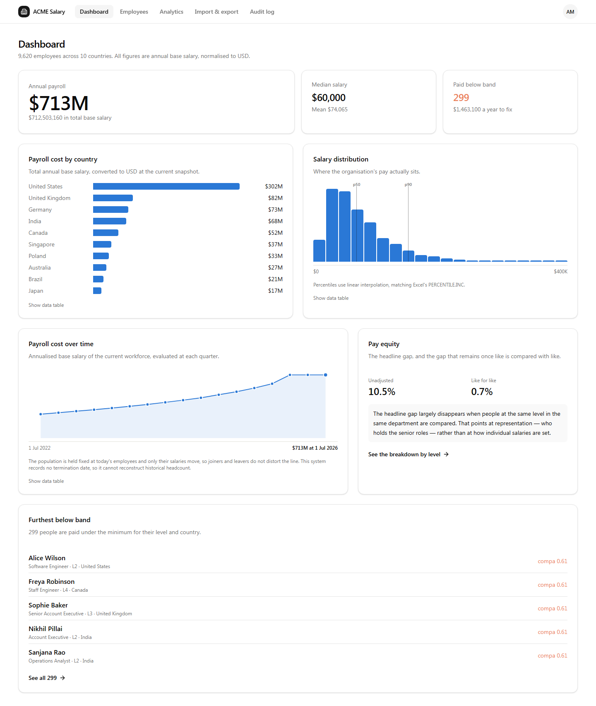

# ACME Salary Management

Salary management for a 10,000-employee, multi-country organisation, built for an
**HR Manager** replacing spreadsheets — and, more to the point, built to answer
questions about how the organisation pays people.

### ▶ [Live demo](https://salarymanagement-assessment-production.up.railway.app)

Sign in with **`hr.manager@acme.example`** / **`DemoPass!2026`** — the form is
prefilled, so the button is enough. All 10,000 employee records are synthetic.



## The question this is really about

The brief asks for salary management software, then adds, almost in passing,
that the HR Manager should be able to *"answer questions about how the org pays
people."* That sentence is the one a spreadsheet cannot satisfy, so the build is
weighted towards it.

The clearest example is on the dashboard:

| | |
|---|---|
| Gender pay gap, unadjusted | **10.5%** |
| Gender pay gap, like for like | **0.7%** |

Those two numbers describe different problems and call for different remedies.
Reporting only the first invites the wrong fix — adjusting individual salaries —
when within any given department and level, pay here is within one percent. The
[representation table](docs/screenshots/06-analytics.png) shows the actual cause:
women are 48.1% of the most junior level and 28.8% of the most senior.

That is a finding rather than a figure, and producing it is the point of the
software.

## Run it locally

```bash
npm install && npm run db:migrate && npm run seed && npm run dev
```

Then <http://localhost:3000>, same credentials as above. Seeding takes about four
seconds and is deterministic — run it twice and you get an identical database.

> **On Windows without C++ build tools**, `npm install` fails: npm automatically
> runs `node-gyp rebuild` for any package with a `binding.gyp` and no install
> script, which `better-sqlite3` has. The compilation is unnecessary — v13 ships
> prebuilt binaries for every platform inside the package — so skip it:
>
> ```bash
> npm install --ignore-scripts && npx playwright install chromium
> ```
>
> The second command is only needed for `npm run test:e2e`. Linux, macOS and the
> Docker image are unaffected.

## What it does

| Screen | Answers |
|---|---|
| [Dashboard](docs/screenshots/02-dashboard.png) | What does payroll cost, and is anything wrong? |
| [Employees](docs/screenshots/03-employees-below-band.png) | Find a person, or a slice of the org — searchable, filterable, 10,000 rows served a page at a time |
| [Employee detail](docs/screenshots/04-employee-detail.png) | How has this person been paid over time? Full salary timeline, band position, [record a change](docs/screenshots/05-raise-dialog.png) with a live preview |
| [Analytics](docs/screenshots/06-analytics.png) | Distribution and percentiles · cost by country, department and level · who sits outside their band and what it costs to fix · pay equity two ways |
| [Import & export](docs/screenshots/07-import-preview.png) | Get off Excel — CSV out, CSV in with a dry-run preview and all-or-nothing apply |
| [Audit log](docs/screenshots/08-audit-log.png) | Who changed what, when |

## Documents

Written before the code, and they explain it.

| | |
|---|---|
| [Requirements](docs/requirements.md) | One page. Goal, scope, and what is deliberately excluded, with reasoning |
| [Architecture](docs/architecture.md) | System shape, the one layering rule, data model, diagrams |
| [Decisions](docs/decisions/) | Five ADRs for the choices that were not obvious |
| [Tradeoffs](docs/tradeoffs.md) | Where a reasonable engineer could have gone the other way |
| [Performance](docs/performance.md) | Measured timings, and an optimisation that worked and was rejected anyway |
| [AI usage](docs/ai-usage.md) | What the tooling did, and the six things it got wrong |
| [Demo script](docs/demo-script.md) | Scene-by-scene walkthrough |

## Architecture in one rule

> **No SQL above a repository. No HTTP below a route handler. No I/O inside `domain/`.**

```
route handler  →  service  →  domain/*   (pure functions, no I/O)
                          →  repository  →  SQLite
```

`src/domain/` being pure is the load-bearing decision: money arithmetic, FX
conversion, compa-ratio, percentiles and pay-gap maths are all testable with no
fixtures, no database and no mocking, which is what makes the suite both fast
and meaningful. [Why a layered monolith rather than two services](docs/architecture.md).

**Stack** — Next.js 16 (App Router, Node runtime) · React 19 · TypeScript strict
· SQLite via `better-sqlite3` · Drizzle ORM · Tailwind 4 + shadcn/ui · Vitest ·
Playwright · Zod. Charts are hand-built HTML and SVG; no charting library ships
to the browser.

## Three things worth looking at

**Money is never a float.** Every amount is an integer in the currency's minor
unit. [`tests/unit/money.test.ts`](tests/unit/money.test.ts) sums ten thousand
salaries and asserts exactness, alongside the float version that drifts.
([ADR-0001](docs/decisions/0001-money-as-integer-minor-units.md))

**Salary history is effective-dated intervals**, never an overwritten column,
with an invariant — exactly one open interval per employee, no overlaps —
enforced in a transaction *and* by a partial unique index in the database.
[`tests/integration/salary-revision.test.ts`](tests/integration/salary-revision.test.ts)
asserts the invariant directly after every case, including back-dating into the
middle of a history. ([ADR-0002](docs/decisions/0002-effective-dated-salary-history.md))

**Percentiles agree between SQL and JavaScript by construction.** SQLite has no
`percentile_cont`, so the analytics select bracketing rows with a window
function — using the same index arithmetic the array implementation uses. Both
match Excel's `PERCENTILE.INC`, deliberately: the HR Manager is migrating from
spreadsheets and will check.

## Tests

```bash
npm test
```

**278 tests in ~10 seconds.** Unit tests cover the pure domain layer with no
setup at all. Integration tests run against a **real in-memory SQLite database**
with migrations applied — no mocked database, because a migrated in-memory
database costs about a millisecond, so testing the real engine is cheaper than
maintaining a fake of it. Nothing touches the network, the filesystem or the
wall clock.

```bash
npm run test:e2e
```

Eleven Playwright tests against a production build and a scratch database. They
do not re-test business rules; they check that the wiring holds end to end.

## Performance

```bash
npm run benchmark
```

Measured against the seeded 10,000 employees and 27,183 compensation rows:

| | Median | p95 |
|---|---:|---:|
| Directory page, unfiltered | 18 ms | 24 ms |
| Directory page, free-text search | 34 ms | 40 ms |
| Employee detail | 0.9 ms | 4.6 ms |
| Whole analytics page | 551 ms | 586 ms |
| Full CSV export (10,000 rows) | 224 ms | 339 ms |
| Full seed | 4.3 s | |

The budgets in that script were originally guessed and were wrong by a factor of
three on the analytics. [performance.md](docs/performance.md) records what was
measured, the four optimisations tried, the one that was kept — and one that
worked and was rejected anyway, with the reasoning.

## Scripts

| Command | Does |
|---|---|
| `npm run dev` | Development server |
| `npm run seed` | Regenerate the deterministic 10,000-employee dataset |
| `npm run boot` | Migrate, and seed only if the database is empty (used in production) |
| `npm test` · `npm run test:e2e` | Unit + integration · end-to-end |
| `npm run benchmark` | Query timings against the budgets |
| `npm run screenshots` | Regenerate `docs/screenshots/` |
| `npm run typecheck` · `npm run lint` | |

## Deployment

`scripts/boot.ts` applies migrations and, if the database is empty, runs the
deterministic seed — so a cold start always yields a known-good 10,000-employee
dataset. Production start is `npm run boot && npm start`.

**Known limitation, deliberately accepted.** The demo runs on a free host with an
**ephemeral filesystem**, so changes made while reviewing do not survive a
spin-down or redeploy. In exchange the demo costs nothing and always comes up in
a known state. Making it durable is one change: mount a volume and set
`DATABASE_PATH` to a path on it. Nothing else in the application changes —
`boot.ts` is a no-op when data already exists.

A free host also sleeps when idle, so the first request after a quiet period
takes around thirty seconds.

Demo credentials are shown on the login screen because the database resets and
the demo is meant to be opened from a link. Set `HIDE_DEMO_CREDENTIALS=true` to
turn that off, which is what a real deployment would do.

## Repository layout

```
docs/         requirements · architecture · ADRs · tradeoffs · performance · AI usage · screenshots
src/app/      routes — pages and API route handlers
src/server/   the backend: db · repositories · services · http
src/domain/   pure functions — money · FX · dates · compensation · statistics · pay equity · CSV
scripts/      seed · boot · benchmark · migrate · analytics-check
tests/        unit · integration · e2e
```
