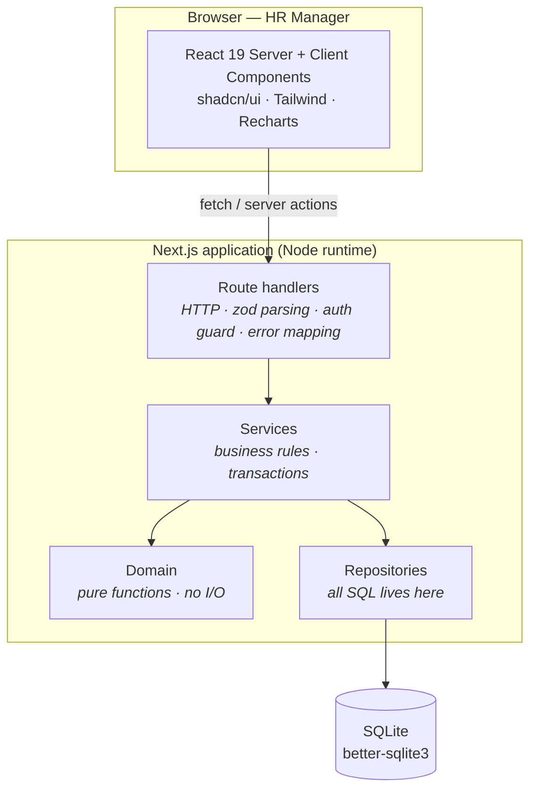
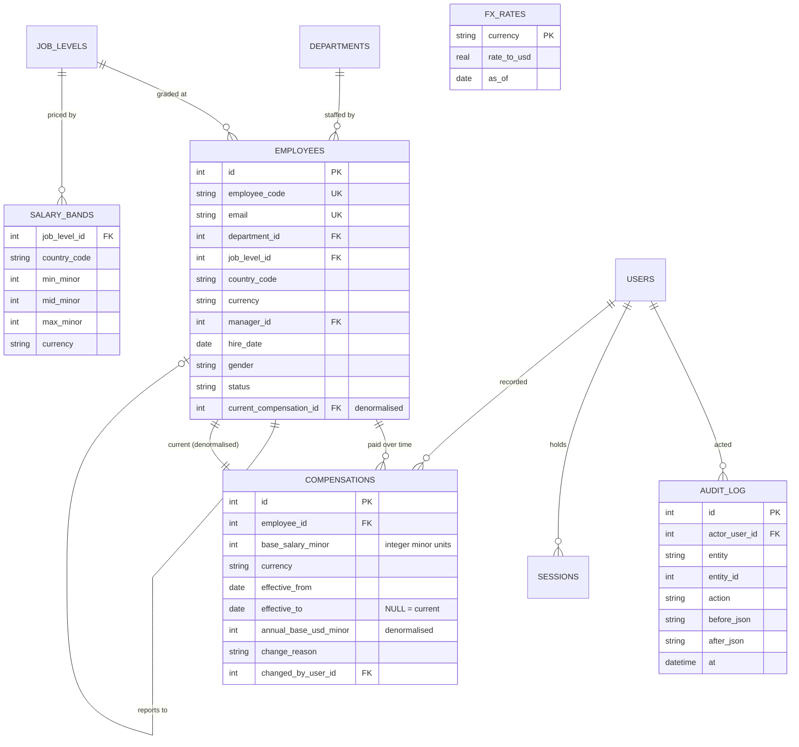
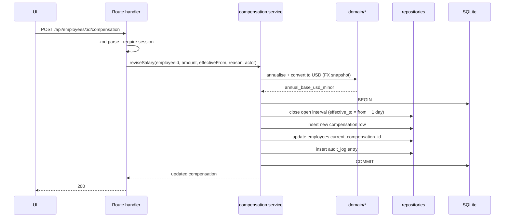

# Architecture

## Shape of the system

One deployable Next.js application. The backend is not a separate service, but it *is* a separate layer: route handlers are a thin HTTP shell over services that have no knowledge of HTTP, and all SQL is confined to repositories.



### The layering rule

> **No SQL above a repository. No HTTP below a route handler. No I/O inside `domain/`.**

This is the one architectural constraint worth enforcing, and everything else follows from it:

- **Services are testable without a web server.** They take plain arguments and return plain values, so integration tests call them directly.
- **Domain functions are testable without anything at all.** Money arithmetic, compa-ratio, percentile selection and pay-gap maths are pure, which is what makes the test suite fast and deterministic rather than merely fast.
- **Swapping the transport is a small change.** If this ever needs to become a standalone API service, `server/` moves wholesale and only `app/api/` is rewritten.

### Why a layered monolith rather than two services

The brief asks for "backend & UI" and rewards engineering judgment over complexity. A separate API service would add a second deployable, a network hop, a CORS surface and duplicated types — in exchange for a separation this layering already provides. For one organisation with a handful of concurrent users, the monolith is the correct size. The layering is what keeps that from becoming an excuse for tangled code.

## Directory layout

```
src/
  app/                       Next.js App Router
    (auth)/login             public
    (app)/                   protected: dashboard · employees · analytics · data · audit
    api/**/route.ts          HTTP layer
  server/                    the backend
    db/                      schema.ts · client.ts · migrations/
    repositories/            employee · compensation · analytics · audit
    services/                employee · compensation · analytics · import · auth
    http/                    zod schemas · error mapping · session guard
  domain/                    money · fx · compensation · statistics · pay-equity   ← pure
  components/                shadcn/ui primitives + feature components
scripts/                     seed · boot · benchmark · recompute-usd
tests/                       unit · integration · e2e
docs/                        artifacts
```

## Data model



Full reasoning for the load-bearing choices lives in [`decisions/`](decisions/). In short:

| Decision | Why |
|---|---|
| Money as **integers in minor units** | Floating point cannot represent decimal currency exactly. All arithmetic goes through `domain/money.ts` with explicit, tested rounding. [ADR-0001](decisions/0001-money-as-integer-minor-units.md) |
| Salary history as **effective-dated intervals** | `effective_to IS NULL` means current. Invariant: exactly one open row per employee, no overlaps. Preserves history and permits back-dating. [ADR-0002](decisions/0002-effective-dated-salary-history.md) |
| **Two denormalisations** | `employees.current_compensation_id` turns the directory query from a correlated subquery into a join; `annual_base_usd_minor` makes analytics pure SQL sums with no FX join. Both maintained transactionally. [ADR-0003](decisions/0003-denormalised-read-paths.md) |
| **SQLite + Drizzle** | Analytics need real SQL — window functions, percentile selection. Drizzle gives typed queries with a clean raw-SQL escape hatch, and synchronous in-memory databases make integration tests near-instant. [ADR-0004](decisions/0004-sqlite-and-drizzle.md) |
| **FX as a dated snapshot** | Deterministic, offline, reproducible. A live rate would make historical reports irreproducible. [ADR-0005](decisions/0005-fx-snapshot-not-live-api.md) |

## How a salary change flows

The one write path with real invariants, so it is worth drawing:



If any step throws, the transaction rolls back and the invariant holds. This is why the pointer update and the audit write live inside the same transaction as the insert rather than in an event handler.

## Performance approach

10,000 employees is small; the engineering interest is in not making it slow by accident.

- **Aggregate in SQL, never in JavaScript.** No analytics endpoint loads rows into memory to reduce them.
- **Server-side pagination** over indexed sorts. The client never receives more than a page.
- **The denormalised current-comp pointer** removes a per-row subquery from the hottest query in the app.
- **Percentiles via `ROW_NUMBER() OVER (ORDER BY …)`**, since SQLite has no `percentile_cont`.
- **Search stays an indexed `LIKE`.** At this row count it is a sub-5ms scan; FTS5 would be infrastructure with no user-visible benefit.

Targets and measured results are in [`performance.md`](performance.md), produced by `scripts/benchmark.ts`.

## Testing approach

Two Vitest projects, split by what they need:

- **`unit`** — pure `domain/` functions. No setup, no fixtures, no database.
- **`integration`** — services and repositories against an **in-memory SQLite** created per test file with migrations applied and a small fixed fixture loaded. The database is never mocked; `better-sqlite3` is synchronous, so a real database is faster than a fake one.

Determinism is structural rather than aspirational: a seeded PRNG, an injected clock and a fixed FX table mean no test touches the network, the filesystem or the wall clock.

## Deployment

Single Node process. `scripts/boot.ts` applies migrations and, if the database is empty, runs the deterministic seed — so a cold start always yields a known-good 10,000-employee dataset.

The host is a free tier with an **ephemeral filesystem**, which is a deliberate, documented tradeoff: edits made during review do not survive a spin-down. The README names the one-line change that makes it durable (mount a volume, or point the driver at hosted libSQL). Nothing else in the system changes.
